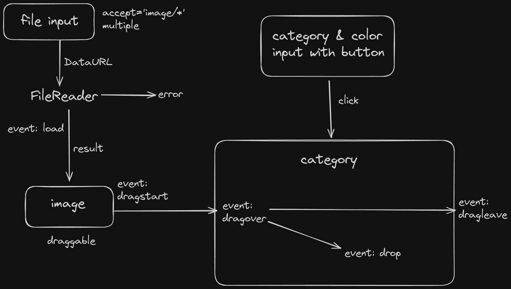

# Meme Generator

A simple yet interesting app that only uses DOM with some events to generate the infamous categories meme used as youtube thumbnails, twitter memes and what not!

## Simplified Overview / Architecture

## Future Plans

- Multiple images dragging
- Meme download
- Category Order Shuffle by drag & drop
- Random unique color category creation on no color choice, that is default category coloring
- Light Mode Switch
